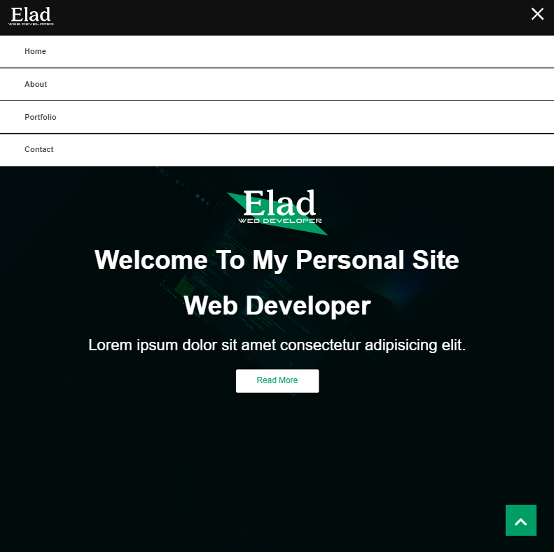
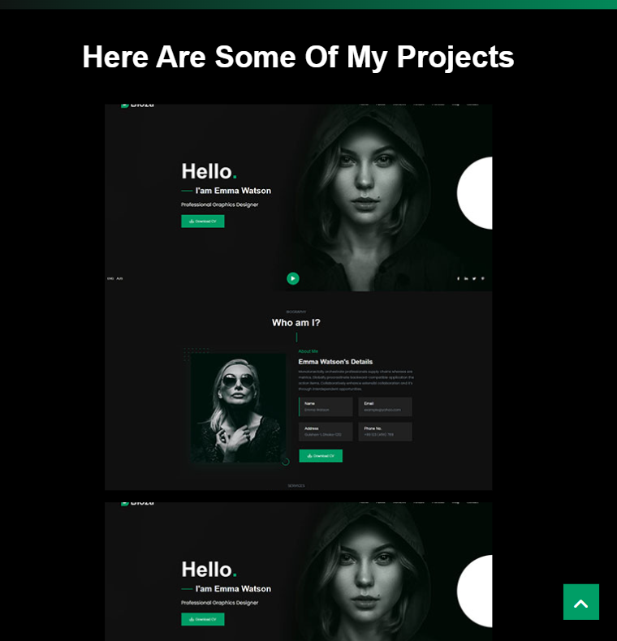

# 🚀 Personal Site
I was given a task @AppleSeeds Bootcamp to make a POC personal portfolio page while only using ```HTML``` and ```CSS```

my design was straightforward and included 4 sections -


#### Home Section 
That allows you to view basic details and the logo, in smaller screen the navbar will only be at the Home Section and will help you navigate the app.

#### About Section
that Contains Personal details about me and lists my skills (ipsum at the moment) + contain a picture of me.

#### porfolio Section
In which you can view links to some of the projects I made along the way.(as of now does not link to the projects, only POC).

#### Contact Section
Contains three cards while each card is holding a diffrent way of contacting me -LinkedIn -Github -Email (all POC).


## Demo site link

https://elad-personal.netlify.app/


## Screenshots







## Deployment

To deploy this project run

```bash
  ./index.html
```
This is a basic site with only one page of ```HTML``` and ```CSS``` styling

